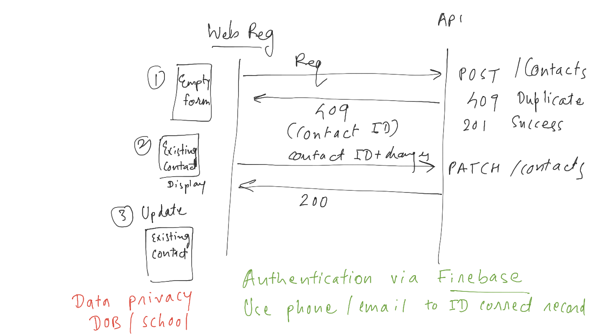
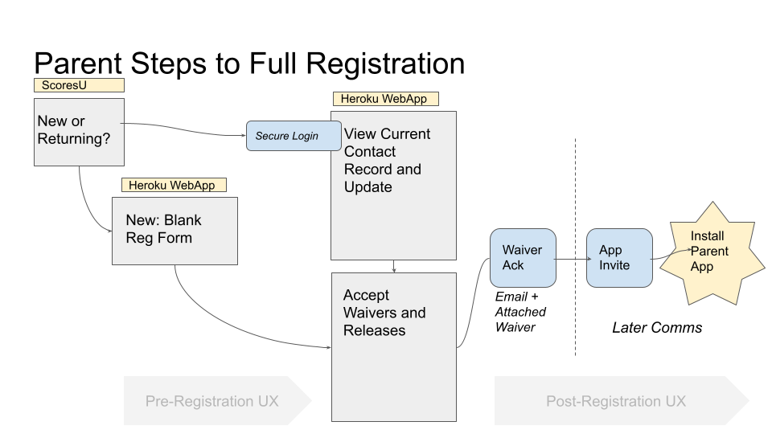

# Safe Waivers and Releases
## Web App and API Interactions


## Scores Students and Family releases are secure, tracked, and actionable with Mulesoft and Salesforce Integration

### Families Must Sign Waivers and Releases Seasonally
● Required by city departments and/or school district
● Required by Scores
● Requires for Scores online education and activities

```
○ Online Youth Privacy Policy (CCPA, PIPPA)
○ Secure Forms and Registration Updates
```

### An Online Solution Must be Secure and Structured

● Forms can be hosted on ASBA squarespace (not critical)
● A Spanish-Language version is required for all forms
● Registration is either New Student or Update Returning and can be determined by parent login (mulesoft proxy API + OAuth)
● Waiver can be hosted on Squarespace (or stored in Salesforce)
● Waiver is different, by region, requiring logic (e.g. School selected in Reg form)
● After waiver is Accepted online it must be emailed to parent (CCPA) ideally from Salesforce

### Registration and Waiver Flow via Web URL

1. Receive a call and/or email from Scores with a link to the Registration form on ScoresU
2. Arriving at the Reg link, Parent enters name and mobile number.
3. If they are returning, they receive an authentication code via SMS to access a populated form for
    them to update and submit
4. If they are new, they receive an authentication code via SMS to access and fill out an empty form



## MVP
-[The San Francisco District Waiver can be used in the MVP release of the Web Registration](waiver_SF.md)
