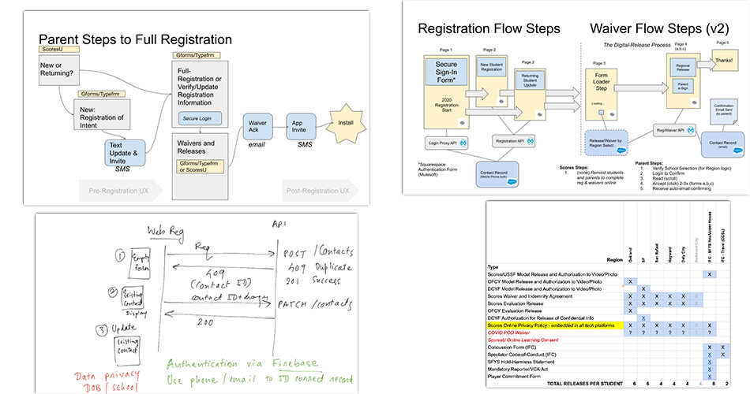

# registration
### America SCORES Registration Form ###
Scores Program relationshiops with school districts, liability insurancxe, and impact reporting goals, require us to colelcting indentifying information, safely and securey, and provide student families/guardians secure access to update or delete records, and accept waivers at any time. The geographic, social, cultural, and economic diversity of the students make _Accessibility_ a key, and evolving, objective.
 
## Student Registration Service Goals ##
This service is intended to run as a low cost webservice deployable on a serverless environment e.g. Heroku.
Families of Scores students are required to provide information to register their student, and this information may sometimes change, such as address or contact info, or be newly required, such as medical or emergency contacts.

The Data is stored in a Salesforce DB, but that is not relevant to this service, presently.

The protection of the family requires a secure authentication strategy. Presently, the first release of the service utilizes _Firebase_.

## Primary User Types ##
| **User Type**    | **Description**                                                                                                           | **Story Goals**                                                                                                                                                                                           |
|------------------|---------------------------------------------------------------------------------------------------------------------------|-----------------------------------------------------------------------------------------------------------------------------------------------------------------------------------------------------------|
| Program Coach    | Interacts directly with students (and often, guardians), provides program experiences, tracking rosters and participation | Can monitor the progress of enrollment and build their roster                                                                                                                                             |
| Program Manager  | Oversees programming, site and district relationships, Coach placement and program performance                            | Facilitate and coordinate the completion of registration and attendance for all their teams/coaches                                                                                                       |
| Region Manager   | Oversees Program delivery and coaching at the district (Region) level                                                     | Facilitate and monitor status of student record completion and participation                                                                                                                              |
| Site Coordinator | site-based staff who oversee coaches on a day to day basis and support registration and attendance.                       | Ability to look after all their kids and afterschool activities and ensure requirements are met between coach and families. Keeping track is their main need. Their responsibility is about participation |
| Parent/Guardian  | legal custodian for Student minor                                                                                         | Needs to determine they want their student participating, quickly complete the paperwork, and confirm it has been received                                                                                |
|                  |                                                                                                                           |                                                                                                                                                                                                           |

### UX Details ###
- Accessbility includes
  - Language Support
  - Mobile and Web support for a majority of devices, browsers, and user platforms
  - Support for Coach-Assisted form completion and tracking

- The first time a family registers, they provide a mobile number where they can receive an SMS with an authentication code to complete the initial registration.
- A returning family updating their contact information, will enter their mobile phone number to identify themselves. The https://github.com/AmericaSCORESBayArea/salesforce-auth-api returns the needed response for _Firebase_ to generate the SMS to that contact number, if it exists. If it is not found, the user will need to complete the initial registration step. Presently, there is nothing to stop a registrant from creating more than one record, provided they use a different phone number for each, and can complete the authentication
- This basic authentiation flow will be used in other web-based services and a future Family App.
- Salesforce will reject new records where firstName, lastName, and DOB match an exissting record.

### Implementation Resources
https://medium.com/javascript-in-plain-english/easy-authentication-system-with-react-and-firebase-for-beginners-780cadc9d5e4

### Design Documentation

[Design](Design.md)

# Developer Setup (React App Version)
For local development:
Node JS app:
  First time running:
      install dependencies:
          - npm init --y
          - npm install axios
          - npm install require
          - npm install express
          - npm install dotenv
  Run with:
     - node server.js
     - on browser go to 'http://localhost:3000/'
